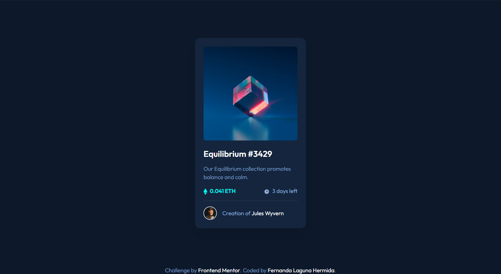
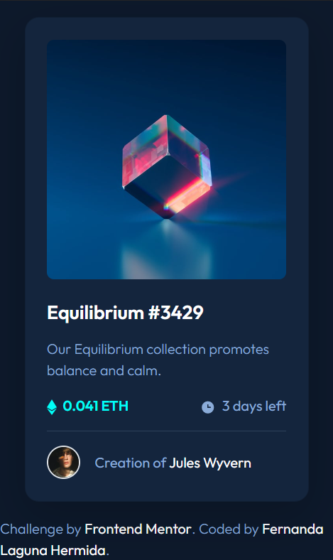

# Frontend Mentor - NFT preview card component solution

This is a solution to the [NFT preview card component challenge on Frontend Mentor](https://www.frontendmentor.io/challenges/nft-preview-card-component-SbdUL_w0U). Frontend Mentor challenges help you improve your coding skills by building realistic projects. 

## Table of contents

- [Overview](#overview)
  - [The challenge](#the-challenge)
  - [Screenshots](#screenshots)
  - [Links](#links)
- [My process](#my-process)
  - [Built with](#built-with)
  - [What I learned](#what-i-learned)
  - [Continued development](#continued-development)
  - [Useful resources](#useful-resources)
- [Author](#author)

## Overview

A responsive card component for a product preview with a button.

### The challenge

Users should be able to:

- View the optimal layout depending on their device's screen size
- See hover and focus states for interactive elements

### Screenshot

### Links

- Solution URL: https://www.frontendmentor.io/challenges/nft-preview-card-component-SbdUL_w0U/hub/card-component-buided-with-bootstrap-nM-uSURHSv
- Live Site URL: https://ferlagher.github.io/FMC-NFT-preview-card

## My process

For this challenge I wanted to try Bootstrap and Sass (*bad idea*). I had a lot of trouble trying to override the default styles. The layout was easy, but customization was a headache.

### Built with

- Semantic HTML5 markup
- CSS custom properties
- Flexbox
- CSS Grid

### What I learned

I stil have **a lot** to learn, this is just the begining. I'll keep practising Bootstrap and Sass.

### Continued development

Next challenge: [Profile card component](https://www.frontendmentor.io/challenges/profile-card-component-cfArpWshJ)

### Useful resources

- [W3Schools](https://www.w3schools.com)
- [Bluuweb tutorial](https://www.youtube.com/watch?v=1kNwZbRiVcQ&t=4686s) *En español*

## Author

- LinkedIn - [ferlagher](https://www.linkedin.com/in/ferlagher/)
- Frontend Mentor - [@ferlagher](https://www.frontendmentor.io/profile/ferlagher)
- Instagram - [@ferlagher](https://www.instagram.com/ferlagher/)

Thank you very much for reading. ♥
